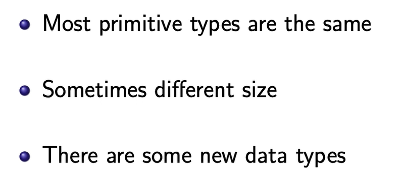
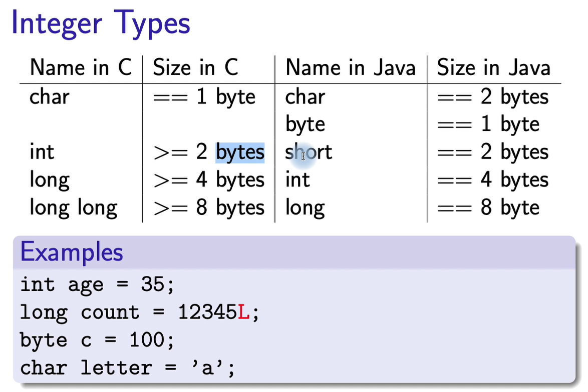

# Week2 Data Type
## 1.Type

## name
1.Identifiers should be descriptive

2.Variable names should start with a lowercase letter

3.Class names should start with an uppercase letter

4.> one word should use camel cas

The name we give to something in Java is an identifier
There are many rules for identifiers:
1.They can contain letters, digits and underscore ( )

2.They cannot start with a digit

3.They cannot contain symbols

4.They cannot contain spaces

5.They cannot be a reserved word

6.They are case sensitive

## Array

1.Arrays in Java are slightly different

2.Array declarations are different

3.Arrays store more information

4.Arrays are objects
